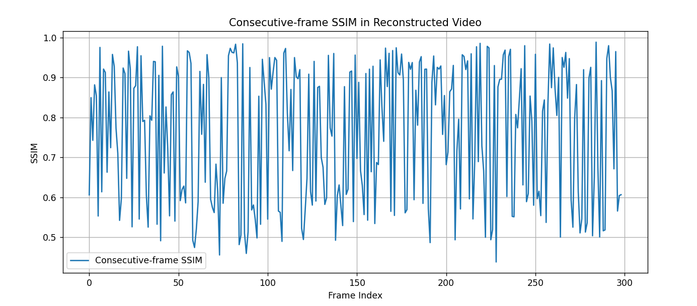
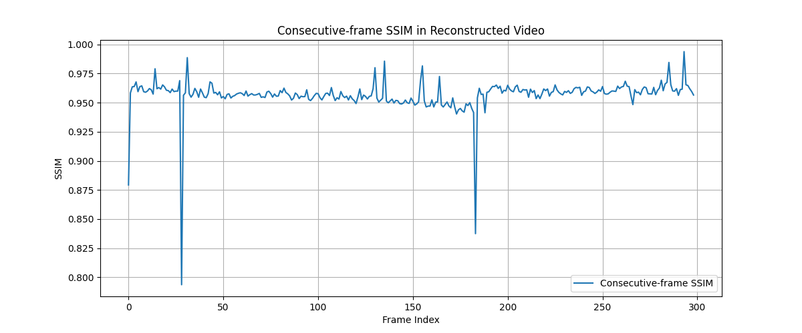

**_Iteration (I)_**

1. extracted each frame
2. calculating similarity score between consecutive frames in pairs and using that to form a ssim matrix
3. this procoess is multiprocessed - meaning calculation between each pair is distributed across cpu cores
4. a greedy search algorithm (travelling salesman) is implemented based on ssim score which returns a matrix with reconstructed order of frames
5. this sequence array is then used to obtain each frame and assemble the video i.e reconstruct the video in this order.

after switching to graph based tsp algorithm:

-[INFO] Average consecutive-frame SSIM: 0.7616 -[INFO] Average consecutive-frame pixel difference: 12.70
-reconstruction needs improvements as this suggests there are misplaced frames in between and avg mean absolute difference needs to be lower
-need to shift to an alternative algorithm

**optimization needed:**
-improve sorting method for frames
-ssim matrix to be formed more accurately instead of computing adjacent frame pairs

---

**_Iteration (II)_**

1. similar process
2. ssim matrix formed by calculating score and computing entire NxN matrix
3. using tsp based heuristic search and running 2 opt local search

**optimization needed:**
-running another algorithm to sort consecutive frames with abnormal ssim score (post processing)
-this can be done by swapping under condition of current frame score increases wrt previous frame
